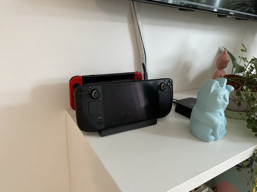
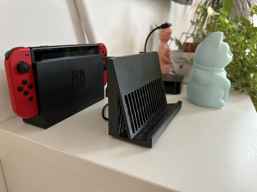
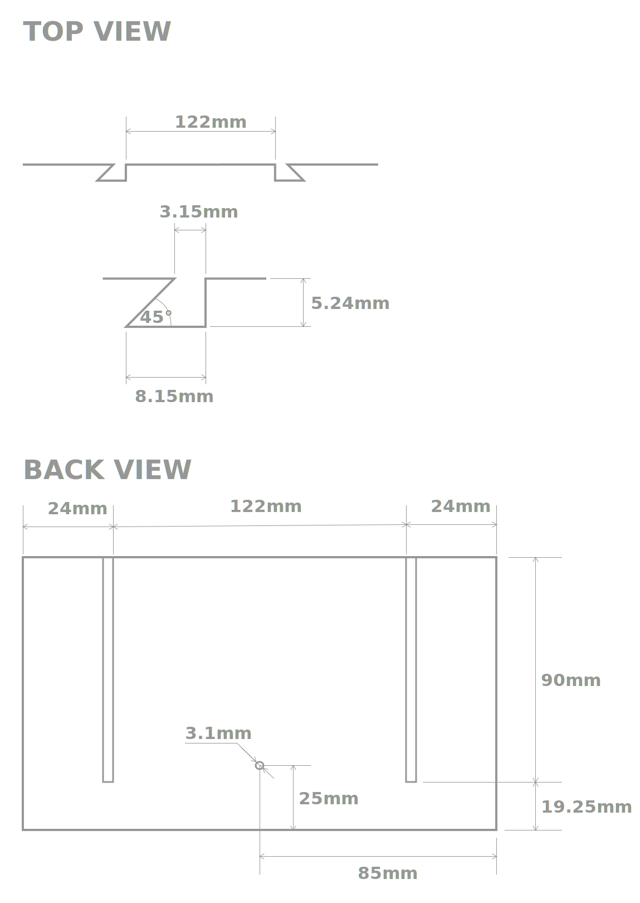

# Para Dock

Para Dock is a modular dock for the SteamDeck that can support most USB-C hubs.

## Hub support

The Para Dock comes in two parts - a base SteamDeck dock and a hub cradle.
The SteamDeck dock part has slots for attaching the cradel to it's back.

Most docks can be supported through this system.

Out of the box this dock comes with cradles for:

* [Anker 555 / 8-in-1 USB-C 10Gbps dock](https://www.anker.com/products/a8383)

## Printing it

The latest STL and 3MF files are in the [`/out` directory](./out/).

The material you print this out of should have decent heat resistance -
like PETG or resins - as the SteamDeck can get hot enough to soften PLA.

Layer height isn't important - 0.3mm is more than fine.

You should use at least 3 (ideally 4) perimeters and 5% infill to make the part
sturdy.

## Contributing

If you want to add a cradle for your USB-C hub please open up a poll request
with the cradle added to the project file.

### Making a cradle for your USB-C hub

Here are the basic measurements needed to create your own cradle.

These are measurements of the Dock because the tolerances for each cradle vary
based on the mounting method and printer used.

For tuned FDM printers a tolerance of 0.15mm give a tight fit.

## Why FreeCAD

I think FreeCAD is an awesome tool, it's free as in beer and as in freedom
(so all camps are covered), and it doesn't impose any limitations on how the
resulting models can be used (e.g. models produced with a free version of
Fusion can't be used in commercial settings).

## Why "Para" dock

In Croatian/Bosnian/Serbian "para" means "steam" and since this is a
Steam-Deck-Dock I though it would be less confusing than
Steam-Deck-Dock-Deck-Dock-...

Additionally, "para" is a colloquialism for "money", usually used to signal that
something is cheap or that you have a small amount of money. And the Para Dock
is a pretty affordable option as it's a 3D print.

(This colloquialism comes from the
[Yugoslav dinar](https://en.wikipedia.org/wiki/Yugoslav_dinar) where cents were
named "para")

## License

This project is licensed under the [MIT license and CC-BY](./LICENSE) license,
use which one suits you better.
Please refer to the [LICENSE](./LICENSE) file for details.
